This is the dev github and a work in progress - most of the documentation is now stable, but don't rely on the same for the code - a stable version will be packaged once finished 

# DyProp: Dynamic Proportionality Analysis

> **A Unified Framework for Genomic Phase Transitions using Vectorized Singular Perturbations**

**DyProp** is a high-performance R/Bioconductor statistical engine designed to identify the *mechanism* of network rewiring in longitudinal genomic data (scRNA-seq, scDNA-seq, Multi-omics).

### The Problem
Traditional trajectory inference often relies on univariate regression or correlation-based networks. However, these methods struggle with the mathematical constraints of **Compositional Data (CoDa)** and often fail to distinguish between a regulated biological transition and a chaotic loss of homeostasis.

### The Solution
**DyProp** moves beyond static correlations by modeling the continuous evolution of gene-gene log-ratios on a quasi-potential landscape. By integrating **Singular Perturbation Theory** with a rigorous **Compositional** framework, it identifies specific "Boundary Functions"—the mathematical signatures of rapid network rewiring.

### Key Capabilities
* **Vectorized C++ Engine:** Bypasses slow iterative regression in favor of dense linear algebra, enabling the scanning of $>10^8$ gene pairs in real-time.
* **Event Classification:** Rigorous distinction between **Stoichiometric Switches** (controlled regulatory shifts, Type 1) and **Decoupling Events** (chaotic loss of regulation, Type 2).
* **Landscape Metrics:** Introduces *Dynamic Instability* ($\Phi$) as a proxy for regulatory stiffness and *Dynamic Coupling* ($\rho$) to track network integrity.

## Theoretical Foundations

DyProp is built on a rigorous integration of Compositional Data Analysis (CoDa) and Dynamical Systems Theory.

* **[Scientific Proposal](inst/theory/DyProp_Scientific_Proposal.pdf):** Detailed breakdown of the Landscape Hypothesis and Regulatory Stiffness.
* **[Mathematical Supplement](inst/theory/DyProp_Math_Supplement.pdf):** Derivations of the Singular Perturbation Boundary Function, the Vectorized Grid Search algorithm, and CoDa-safe robustness proofs.
* **[Algorithm Implementation](inst/theory/DyProp_Implementation_Algorithm.pdf):** Technical specification of the C++ backend and the Multi-Evidence Decision Tree.

## DyProp Workflow Architecture

```mermaid
graph TD
    %% Define Styles
    classDef cpp fill:#e1f5fe,stroke:#01579b,stroke-width:2px;
    classDef rstat fill:#f3e5f5,stroke:#4a148c,stroke-width:2px;
    classDef data fill:#fff3e0,stroke:#e65100,stroke-width:1px,stroke-dasharray: 5 5;
    classDef network fill:#fbe9e7,stroke:#d84315,stroke-width:2px;

    %% --- PHASE 0: PRE-PROCESSING ---
    subgraph PreProcessing [Phase 0: CoDa-Safe Transformation]
        Input[("<b>Input Data</b><br/>Raw Counts + Pseudotime")]:::data
        Input --> Dropout["<b>Step A: kNN Pooling</b><br/>(Fixes Technical Dropout)"]
        Dropout --> Impute["<b>Step B: Bayesian Imputation</b><br/>(Fixes Biological Zeros)"]
        Impute --> CLR["<b>Step C: CLR Transform</b><br/>(Preserves Geometry)"]
        CLR --> Ratios["<b>Step D: Robust Ratios</b><br/>Vector Y = clr_j - clr_k<br/>(Winsorized)"]
    end

    %% --- PHASE 1: DISCOVERY ---
    subgraph Stage1 [Phase I: Vectorized Discovery C++]
        direction TB
        Dict[Generate Dictionary M<br/>Singular Perturbation Curves]:::cpp
        Ratios --> MatMul[<b>Matrix Convolution</b><br/>R = Y * M_transpose]:::cpp
        MatMul --> MaxScore[Identify Best Fit Archetype<br/>Tau_grid, Epsilon_grid]:::cpp
        MaxScore --> Interp[<b>Quadratic Interpolation</b><br/>Refine Parameters]:::cpp
    end

    %% --- PHASE 2: CLASSIFICATION ---
    subgraph Stage2 [Phase II: Multi-Evidence Classification]
        Interp --> DecPhi{Is Phi High?}:::rstat
        DecPhi -- No --> Homeo[Homeostasis<br/>Stable State]:::data
        DecPhi -- Yes --> DecRho{Is Rho High?}:::rstat
        
        DecRho -- No --> Decoup[<b>Event: Decoupling</b><br/>Type 2: Network Melting]:::data
        DecRho -- Yes --> DecShape{Is Fit Smooth?}:::rstat
        
        DecShape -- No --> Decoup
        DecShape -- Yes --> Switch[<b>Event: Stoich. Switch</b><br/>Type 1: Controlled Transition]:::data
    end

    %% --- PHASE 3: VALIDATION ---
    subgraph Stage3 [Phase III: Hierarchical Validation]
        Switch --> GLMM[<b>Fit GLMM</b><br/>y ~ Spline + 1&#124;Patient]:::rstat
        Decoup --> GLMM
        GLMM --> Pval[Calculate FDR<br/>Condition-Specific Dynamics]:::rstat
    end

    %% --- PHASE 4: NETWORK RECON ---
    subgraph Stage4 [Phase IV: Topology Reconstruction]
        Switch -.-> Slice["<b>Temporal Slicing</b><br/>Split: Pre-Tau vs Post-Tau"]:::network
        Slice --> DiffNet["<b>Differential Topology</b><br/>Calc Delta Rho"]:::network
        DiffNet --> Hubs["<b>Hub Analysis</b><br/>Identify 'Haywire' Regulators"]:::network
        Hubs --> Motif["<b>Regulator Inference</b><br/>TF Motif Scanning"]:::network
    end

    %% Connectors
    Dict -.-> MatMul
```

**Figure 1: The DyProp Engine.** The framework utilizes a three-stage hybrid architecture. **Phase I** leverages a C++ backend to perform a global vectorized search of the topological parameter space ($>10^8$ pairs). **Phase II** applies a multi-evidence classifier to distinguish between controlled stoichiometric switches and chaotic network decoupling. **Phase III** employs a post-hoc Generalized Linear Mixed Model (GLMM) to validate candidates against patient-level random effects.
